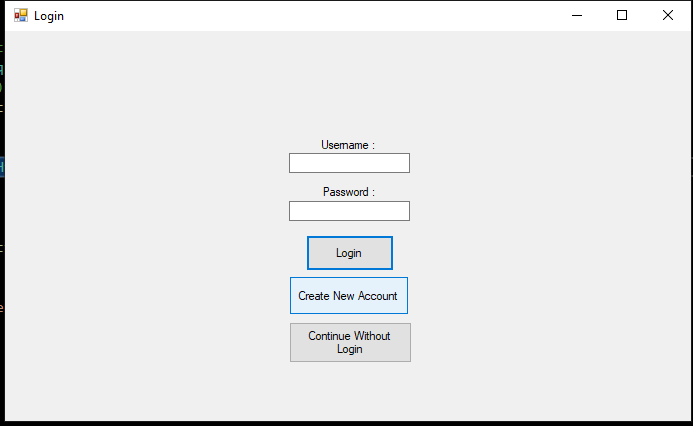
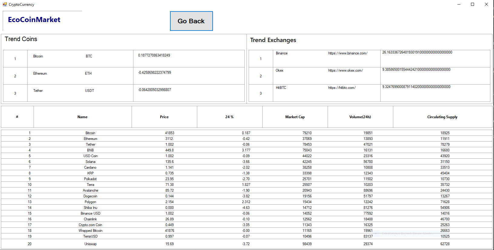
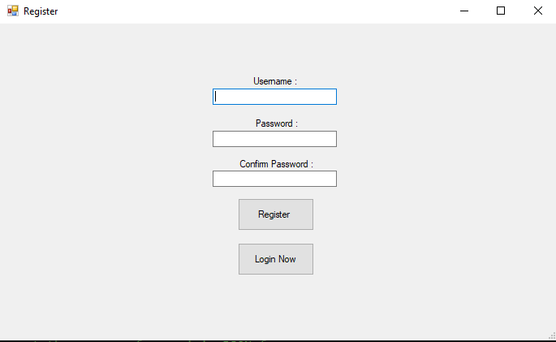
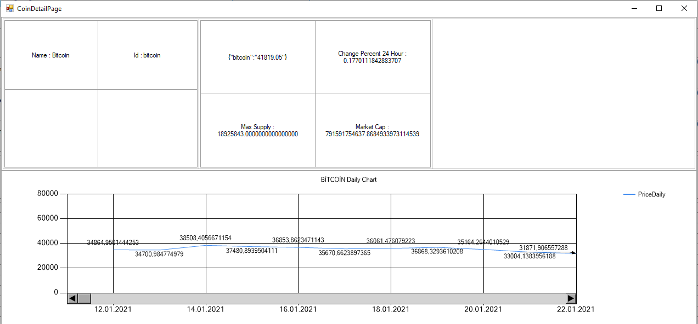

<div id="top"></div>


<!-- PROJECT SHIELDS -->
<!--
*** I'm using markdown "reference style" links for readability.
*** Reference links are enclosed in brackets [ ] instead of parentheses ( ).
*** See the bottom of this document for the declaration of the reference variables
*** for contributors-url, forks-url, etc. This is an optional, concise syntax you may use.
*** https://www.markdownguide.org/basic-syntax/#reference-style-links
-->
<!-- [![Contributors][contributors-shield]][contributors-url] -->
[![MIT License][license-shield]][license-url]
[![LinkedIn][linkedin-shield]][linkedin-url]
[![LinkedIn][linkedin-shield]][linkedin-url2]


<!-- PROJECT LOGO -->
<br />
<div align="center">
<!--   <a href="https://github.com/othneildrew/Best-README-Template">
     -->
  </a>

  <h3 align="center">Crypto Currency MarketPlace</h3>
</div>


<!-- TABLE OF CONTENTS -->
<!-- <details>
  <summary>Table of Contents</summary>
  <ol>
    <li>
      <a href="#about-the-project">About The Project</a>
      <ul>
        <li><a href="#built-with">Built With</a></li>
      </ul>
    </li>
    <li>
      <a href="#getting-started">Getting Started</a>
    </li>
    <li><a href="#contact">Contact</a></li>
<!--     <li><a href="#acknowledgments">Acknowledgments</a></li> -->
  </ol>
</details> 


<!-- ABOUT THE PROJECT -->
## About The Project

[![Product Name Screen Shot][product-screenshot]](https://example.com)

EcoCoinMarket is a desktop application which provide data about 100 crypto coin such as real time price, daily price, 24H change percentages, Market Cap. Using charts tables in a simple user interface. 

<p align="right">(<a href="#top">back to top</a>)</p>


### Built With


* [C#](https://docs.microsoft.com/tr-tr/dotnet/csharp/)
* [Visual Studio 2019](https://docs.microsoft.com/tr-tr/visualstudio/releases/2019/release-notes)
* [NewtonSoft.Json](https://www.nuget.org/packages/Newtonsoft.Json/)
* [WebSocket-Sharp](https://github.com/sta/websocket-sharp)
* [Windows Form](https://docs.microsoft.com/tr-tr/visualstudio/ide/step-1-create-a-windows-forms-application-project?view=vs-2022)
* [MsSQL](https://www.microsoft.com/tr-tr/sql-server/sql-server-2019)
* [Quick Type](https://quicktype.io)
* [Postman](https://www.postman.com)

<p align="right">(<a href="#top">back to top</a>)</p>


<!-- GETTING STARTED -->
<!-- ## Getting Started

This is an example of how you may give instructions on setting up your project locally.
To get a local copy up and running follow these simple example steps.

### Prerequisites

This is an example of how to list things you need to use the software and how to install them.
* npm
  ```sh
  npm install npm@latest -g ```-->

 ### Installation

  Clone the repo
   ```sh
   git clone https://github.com/onurural/EcoCoinMarketPlace.git
   ```

<p align="right">(<a href="#top">back to top</a>)</p>


<!-- USAGE EXAMPLES -->
<!-- ## Usage

Use this space to show useful examples of how a project can be used. Additional screenshots, code examples and demos work well in this space. You may also link to more resources.

_For more examples, please refer to the [Documentation](https://example.com)_

<p align="right">(<a href="#top">back to top</a>)</p> --> 


<!-- ROADMAP -->
<!-- ## Roadmap

- [x] Add Changelog
- [x] Add back to top links
- [ ] Add Additional Templates w/ Examples
- [ ] Add "components" document to easily copy & paste sections of the readme
- [ ] Multi-language Support
    - [ ] Chinese
    - [ ] Spanish

See the [open issues](https://github.com/othneildrew/Best-README-Template/issues) for a full list of proposed features (and known issues).

<p align="right">(<a href="#top">back to top</a>)</p> -->


<!-- CONTRIBUTING -->


<!-- LICENSE -->
<!-- ## License

Distributed under the MIT License. See `LICENSE.txt` for more information.

<p align="right">(<a href="#top">back to top</a>)</p> -->

 
 
 
 


<!-- CONTACT -->
## Contact

Onur Ural - [@onururallll](https://twitter.com/onururalll) - onurural57@gmail.com

Berke Genckaya - [@Berke_genckaya](https://twitter.com/Berke_genckaya) 

Project Link: [https://github.com/onurural/EcoCoinMarketPlace](https://github.com/onurural/EcoCoinMarketPlace)

<p align="right">(<a href="#top">back to top</a>)</p>


<!-- MARKDOWN LINKS & IMAGES -->
<!-- https://www.markdownguide.org/basic-syntax/#reference-style-links -->
[contributors-shield]: https://img.shields.io/github/contributors/othneildrew/Best-README-Template.svg?style=for-the-badge
[contributors-url]: https://github.com/onurural/EcoCoinMarketPlace/graphs/contributors
[forks-shield]: https://img.shields.io/github/forks/othneildrew/Best-README-Template.svg?style=for-the-badge
[forks-url]: https://github.com/othneildrew/Best-README-Template/network/members
[stars-shield]: https://img.shields.io/github/stars/othneildrew/Best-README-Template.svg?style=for-the-badge
[stars-url]: https://github.com/othneildrew/Best-README-Template/stargazers
[issues-shield]: https://img.shields.io/github/issues/othneildrew/Best-README-Template.svg?style=for-the-badge
[issues-url]: https://github.com/othneildrew/Best-README-Template/issues
[license-shield]: https://img.shields.io/github/license/othneildrew/Best-README-Template.svg?style=for-the-badge
[license-url]: https://github.com/othneildrew/Best-README-Template/blob/master/LICENSE.txt
[linkedin-shield]: https://img.shields.io/badge/-LinkedIn-black.svg?style=for-the-badge&logo=linkedin&colorB=555
[linkedin-url]: https://www.linkedin.com/in/onur-ural-528b3b1b0/
[linkedin-url2]: https://www.linkedin.com/in/berke-gençkaya-791423189/
<!-- [product-screenshot]: images/screenshot.png TODO -->
